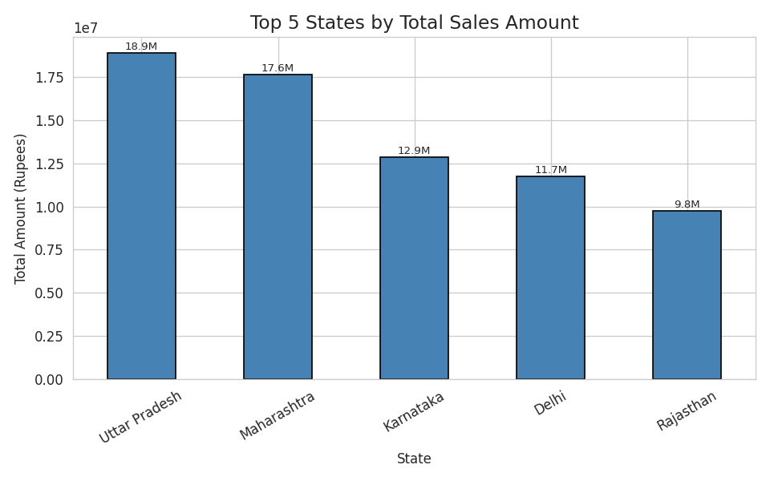
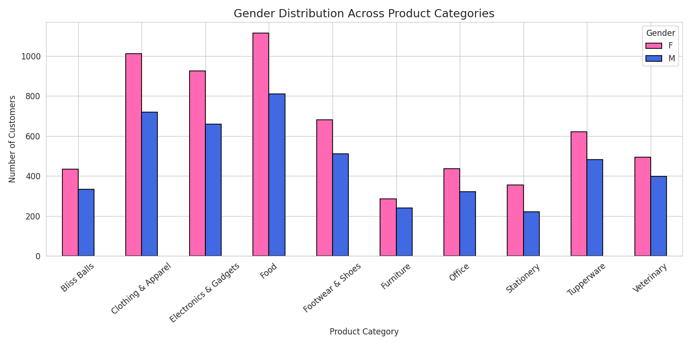
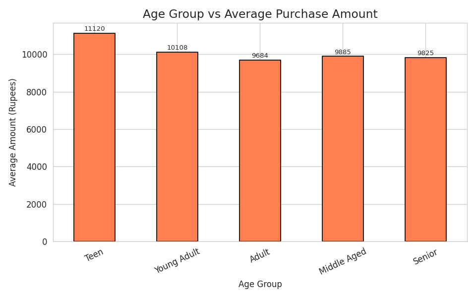
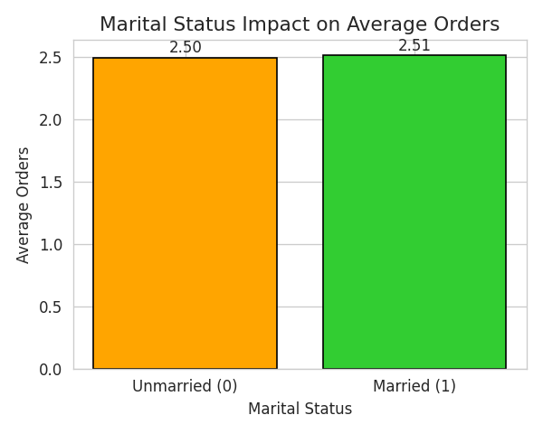
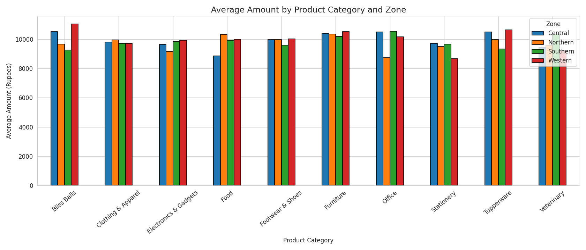

# Diwali Sales Data Analysis

An end-to-end exploratory data analysis (EDA) of a Diwali retail sales
dataset (~11,000 transactions), covering data cleaning, visual analysis,
and formal statistical hypothesis testing using pandas, seaborn, and
SciPy.

## What it does

The script runs through a full analysis pipeline, printed and plotted
section by section:

1. **Data understanding** - shape, dtypes, missing values, column preview.
2. **Data preparation** - documents what every column means (business
   context, not just data types).
3. **Data cleaning** - converts `Age Group` to an ordered categorical,
   handles missing/empty columns, standardises types.
4. **Data analysis** - descriptive statistics, skewness/kurtosis of the
   purchase amount distribution.
5. **Data exploration (visualizations)** - five charts saved to
   `outputs/`:
   - Top 5 states by sales
   - Gender vs. product category purchasing patterns
   - Age group vs. amount spent
   - Marital status vs. order volume
   - Zone vs. product category breakdown
6. **Statistical testing** - a one-way ANOVA and a Chi-square test of
   independence (e.g. product category vs. zone) with explicit
   hypotheses, test statistics, and plain-English conclusions.

## Project structure

```
diwali-sales-analysis/
├── data/
│   └── Diwali Sales Data.csv
├── src/
│   └── analysis.py
├── outputs/
│   ├── plot1_top5_states.png
│   ├── plot2_gender_product.png
│   ├── plot3_agegroup_amount.png
│   ├── plot4_marital_orders.png
│   └── plot5_zone_category.png
├── requirements.txt
└── README.md
```

## Requirements

- Python 3.9+
- pandas, numpy, matplotlib, seaborn, scipy (see `requirements.txt`)

## Installation

```bash
git clone <your-repo-url>
cd diwali-sales-analysis
pip install -r requirements.txt
```

## Usage

Run from the project root (or anywhere - paths are resolved relative to
the project folder, not the current working directory):

```bash
python src/analysis.py
```

This prints the full analysis to the terminal and (re)generates all five
charts in `outputs/`.

## Sample output

These are generated directly by the script from the included dataset.

**Top 5 states by sales**



**Gender vs. product category**



**Age group vs. amount spent**



**Marital status vs. order volume**



**Zone vs. product category**



## Possible extensions

- Turn the script into a parameterised Jupyter notebook or a small Streamlit
  dashboard
- Add a customer-segmentation model (RFM analysis / k-means) on top of the
  existing cleaned data
- Automate report generation (PDF/HTML) from the printed statistics
